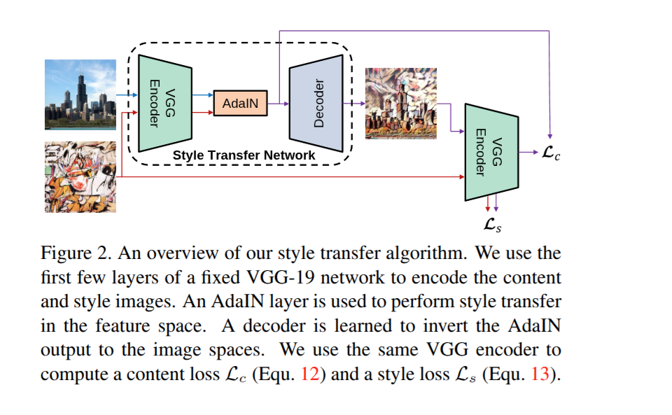

# 🎨 AI Neural Style Transfer using AdaIN

An **AI-based Neural Style Transfer** project that combines the content of one image with the artistic style of another image using **Adaptive Instance Normalization (AdaIN)**.

The project uses a pretrained **VGG-19 encoder**, an AdaIN operation in feature space, and a learned **decoder** to reconstruct the stylized image. A Flask web application provides a simple interface for uploading content/style images and generating the final result.

<p align="left">
  
  
  
  
  
  
  
</p>

---

## ✨ Features

- 🖼️ Upload a **Content Image**
- 🎨 Upload a **Style Image**
- 🤖 Perform neural style transfer using **AdaIN**
- 🎚️ Control the strength of style transfer using the **Alpha** parameter
- ⚡ Supports CPU and CUDA automatically
- 🌐 Flask-based web interface
- 📁 Saves uploaded and generated images
- 🧠 Includes a decoder-training pipeline
- 🚀 Configured for deployment with Gunicorn

---

## 🧠 How It Works

The main idea is to transfer the statistical properties of the style image's feature representation to the content image.

### Pipeline

```text
             CONTENT IMAGE
                   │
                   ▼
             VGG-19 Encoder
                   │
                   │ Content Features
                   ▼
                ┌───────┐
STYLE IMAGE ──► │ AdaIN │ ◄── Style Features
                └───────┘
                   │
                   ▼
          Stylized Feature Map
                   │
                   ▼
                Decoder
                   │
                   ▼
          🎨 Stylized Image
```

The project follows the AdaIN style-transfer architecture shown below:



### Step-by-step

1. The **content image** is passed through the VGG-19 encoder.
2. The **style image** is also passed through the same encoder.
3. The content and style feature maps are combined using **Adaptive Instance Normalization (AdaIN)**.
4. The resulting stylized feature representation is optionally blended with the original content features using `alpha`.
5. A trained **decoder** converts the feature representation back into an RGB image.
6. The output is saved as the final stylized image.

---

## 🧮 Adaptive Instance Normalization (AdaIN)

AdaIN aligns the channel-wise mean and standard deviation of the content features with those of the style features.

Conceptually:

```text
AdaIN(content, style)
        ↓
Normalize content features
        ↓
Apply style mean and style standard deviation
        ↓
Stylized feature representation
```

The implementation uses:

```python
stylized_feats = adaptive_instance_normalization(
    content_feats,
    style_feats
)
```

The style strength can then be controlled with:

```python
stylized_feats = (
    alpha * stylized_feats
    + (1 - alpha) * content_feats
)
```

### Alpha

| Alpha | Effect |
|---|---|
| `0.0` | Mostly original content |
| `0.5` | Balanced content/style mixture |
| `1.0` | Full AdaIN stylization |

---

## 🏗️ Project Architecture

The project contains two main parts:

### 1. Training Pipeline

`train.py` trains the decoder while keeping the VGG encoder fixed.

The training process:

```text
Content Dataset ──► VGG Encoder ──► Content Features
                                      │
                                      ▼
Style Dataset ─────► VGG Encoder ──► Style Features
                                      │
                                      ▼
                                    AdaIN
                                      │
                                      ▼
                                   Decoder
                                      │
                                      ▼
                              Generated Image
                                      │
                                      ▼
                              VGG Encoder Again
                                      │
                         ┌────────────┴────────────┐
                         ▼                         ▼
                    Content Loss              Style Loss
                         └────────────┬────────────┘
                                      ▼
                                Total Loss
                                      │
                                      ▼
                              Update Decoder
```

The training script uses:

- Adam optimizer
- MSE loss
- Content loss
- Style loss
- Learning-rate decay
- Configurable batch size and image sizes
- Decoder checkpoint saving

---

## 🌐 Web Application

The Flask application is implemented in `app.py`.

The application:

1. Accepts content and style images.
2. Validates the uploaded file extensions.
3. Loads the images using PIL.
4. Resizes them to `512`.
5. Extracts features using VGG.
6. Applies AdaIN.
7. Applies the selected alpha value.
8. Decodes the feature representation.
9. Saves and displays the stylized image.

The application automatically selects:

```python
cuda
```

when CUDA is available; otherwise it uses:

```python
cpu
```

---

## 📂 Project Structure

A typical project structure is:

```text
ai-nst-project/
│
├── app.py
├── train.py
├── README.md
├── requirements.txt
├── Procfile
├── .gitignore
│
├── adain_algo.png
├── vgg_normalised.pth
│
├── utils/
│   ├── models.py
│   └── utils.py
│
├── templates/
│   └── index.html
│
├── static/
│   └── uploads/
│
├── examples/
│
├── content_data/
├── style_data/
│
└── experiment/
    └── ...
```

> The exact contents of `utils/`, `templates/`, datasets, and experiment folders depend on your local project setup.

---

## ⚙️ Technologies Used

- **Python**
- **PyTorch**
- **Torchvision**
- **VGG-19**
- **AdaIN**
- **Flask**
- **Flask-WTF**
- **Pillow**
- **NumPy**
- **Gunicorn**

---

## 📦 Installation

### 1. Clone the repository

```bash
git clone <YOUR_GITHUB_REPOSITORY_URL>
cd ai-nst-project
```

### 2. Create a virtual environment

```bash
python -m venv .venv
```

Activate it on Windows:

```bash
.venv\Scripts\activate
```

On Linux/macOS:

```bash
source .venv/bin/activate
```

### 3. Install dependencies

```bash
pip install -r requirements.txt
```

The current dependency list includes Flask, PyTorch, Torchvision, Pillow, NumPy, Flask-WTF, WTForms, tqdm, Werkzeug, and Gunicorn.

---

## 🧠 Model Files

The application requires the pretrained VGG model:

```text
vgg_normalised.pth
```

The decoder also requires a trained decoder checkpoint.

Before running the Flask application, make sure the required model checkpoints are available and that their paths match your environment.

### Important

The current `app.py` contains a hard-coded Windows path for the decoder checkpoint:

```python
C:\Users\DELL\Desktop\AI-NST-Project\experiment\final_exp\decoder_final.pth
```

For another computer or cloud deployment, this path should be changed to a project-relative or environment-configured path, for example:

```python
DECODER_PATH = "experiment/final_exp/decoder_final.pth"
```

This is especially important when deploying to platforms such as Render.

---

## 🚀 Run the Web Application

After installing the dependencies and placing the model files correctly:

```bash
python app.py
```

The Flask application runs locally on:

```text
http://localhost:5000
```

Then:

1. Select a content image.
2. Select a style image.
3. Set the desired alpha value.
4. Click **Transfer Style**.
5. View the generated stylized image.

---

## 🏋️ Training the Decoder

The decoder can be trained using:

```bash
python train.py
```

The training script supports configurable arguments.

### Example

```bash
python train.py \
    --content_dir ./content_data \
    --style_dir ./style_data \
    --vgg ./vgg_normalised.pth \
    --experiment experiment1 \
    --batch_size 4 \
    --lr 1e-4 \
    --epochs 1
```

### Important training parameters

| Parameter | Purpose | Default |
|---|---|---:|
| `--content_dir` | Content dataset location | `.../content_data` |
| `--style_dir` | Style dataset location | `.../style_data` |
| `--vgg` | VGG checkpoint path | `.../vgg_normalised.pth` |
| `--experiment` | Experiment name | `experiment1` |
| `--final_size` | Final image size | `256` |
| `--content_size` | Content image size | `512` |
| `--style_size` | Style image size | `512` |
| `--batch_size` | Training batch size | `4` |
| `--lr` | Learning rate | `1e-4` |
| `--lr_decay` | Learning-rate decay | `5e-5` |
| `--epochs` | Number of epochs | `1` |
| `--content_weight` | Content-loss weight | `1.0` |
| `--style_weight` | Style-loss weight | `5` |

---

## 📉 Loss Functions

The training process uses two main losses.

### Content Loss

The generated image is encoded again using VGG and compared with the AdaIN target features.

```text
Content Loss =
MSE(Generated Features, AdaIN Features)
```

### Style Loss

For each VGG feature level, the mean and standard deviation of generated and style features are compared.

```text
Style Loss =
MSE(Generated Mean, Style Mean)
+
MSE(Generated Std, Style Std)
```

The total loss is:

```text
Total Loss = Content Loss + Style Loss
```

The training script multiplies the content and style terms by their configurable weights.

---

## 📊 Training Output

Training checkpoints are saved inside the selected experiment directory.

For example:

```text
experiment/
└── experiment1/
    ├── args.txt
    ├── decoder_2.pth
    ├── optimizer_2.pth
    └── output_2.png
```

The exact files depend on the configured `save_interval` and number of epochs.

---

## ☁️ Deployment

The project includes a `Procfile` configured to start the Flask application using Gunicorn:

```text
web: gunicorn --bind :$PORT app:app
```

For deployment, make sure:

- `requirements.txt` is present.
- `Procfile` is present.
- Required model files are available.
- Decoder checkpoint paths are not hard-coded to a local Windows machine.
- The Flask app can locate the `utils`, templates, static files, and model checkpoints.

---

## 🔐 File Uploads

The web application accepts:

```text
.png
.jpg
.jpeg
```

Uploaded files are stored under:

```text
static/uploads
```

The application creates this directory automatically if it does not already exist.

---

## 🎯 Use Cases

Neural style transfer can be used for:

- 🎨 Artistic image generation
- 🖼️ Digital art creation
- 📸 Creative photo editing
- 🧑‍🎨 Art-style experimentation
- 🤖 Computer vision demonstrations
- 📚 Deep learning education and experimentation

---

## 🔬 Model Concept

The core architecture is based on **Adaptive Instance Normalization (AdaIN)** for arbitrary style transfer.

Instead of training a separate model for every style, AdaIN transfers style statistics directly in feature space. This allows the same trained decoder to work with different content and style images.

---

## 📝 Notes

- The VGG encoder is used as a fixed feature extractor during decoder training.
- The decoder is the component trained to reconstruct images from AdaIN feature representations.
- GPU acceleration is used automatically when CUDA is available.
- The uploaded application code currently contains a machine-specific decoder checkpoint path; update it before deployment.
- Model checkpoint files can be large, so repository hosting/storage limits should be considered before committing them to Git.

---

## 👨‍💻 Author

**Shekhar Ray**

GitHub: `https://github.com/shekharray24`

---

## ⭐ Project Summary

**AI Neural Style Transfer using AdaIN** is a deep-learning project that transforms an input content image into an artistic image by transferring the visual style of a separate reference image. It combines a fixed VGG-19 encoder, Adaptive Instance Normalization, and a learned decoder, with a Flask interface for practical image-to-image style transfer.

